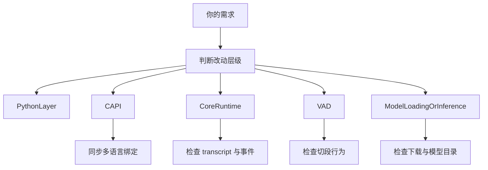
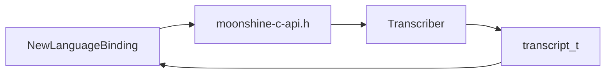

# Moonshine 二次开发指南

## 1. 这份文档解决什么问题

`原理及工作流程.md` 主要回答的是：

- 这个项目是什么
- 它怎么运行
- 主流程在哪里

而这份 `二次开发指南.md` 主要回答的是另一类问题：

- 如果我要改功能，应该从哪一层下手
- 如果我要加一种能力，会影响哪些文件
- 如果我要新增绑定、事件、参数或调试能力，推荐路径是什么
- 改动时最容易踩哪些坑

一句话概括：

**这是一份面向“准备改 Moonshine 源码”的开发者手册。**

## 2. 二次开发前先记住 4 条原则

### 2.1 优先判断你要改的是哪一层

Moonshine 的职责分层很清楚，动手前先判断问题属于哪一层：

- `python/`：开发者接口、事件分发、模型下载、命令行示例
- `core/moonshine-c-api.*`：跨语言公共协议层
- `core/transcriber.*`：运行时主流程
- `core/voice-activity-detector.*`：切段和 VAD 状态机
- `core/*model*`：模型加载与推理逻辑

大多数改动之所以越改越乱，不是因为难，而是因为一开始层次判断错了。

### 2.2 优先从最小影响面开始改

很多需求其实并不需要动到底层核心。

例如：

- 只是想调整更新频率：先改参数，不要改主流程
- 只是想加一个 Python 事件封装：先看 `transcriber.py`
- 只是想加调试日志：先看 Python 或 C API 层
- 只有真的需要底层行为变化时，再改 `core/`

### 2.3 `core/moonshine-c-api.h` 是公共协议，不要轻易破坏兼容性

一旦你修改这里的结构体或函数签名，往往会连带影响：

- Python `ctypes` 映射
- Swift 绑定
- Android/JNI
- C++ 头文件封装

所以：

- 纯内部逻辑优化，尽量不要改 C API
- 只有跨语言都需要感知的新能力，才考虑改 C API

### 2.4 先保证主链稳定，再加附加能力

Moonshine 的主链是：

`音频输入 -> VAD -> segment -> ASR -> transcript -> event`

附加能力包括：

- speaker identification
- word timestamps
- intent recognition
- 调试日志

做二开时优先确保主链不被破坏，再考虑附加能力是否同步更新。

## 3. 改代码前建议先回答这 5 个问题

1. 这次修改影响的是“输入音频”“语音段”“文本 line”还是“事件/业务”？
2. 这次修改是否需要跨语言暴露？
3. 这次修改会不会影响 transcript 结构或 line flags？
4. 这次修改是否需要新增配置参数？
5. 这次修改后，哪些示例或绑定最容易被连带破坏？

如果这五个问题没想清楚，最好先不要直接改 `core/transcriber.cpp`。

## 4. 仓库里最常作为二开入口的地方

### 4.1 改上层使用体验

优先看：

- `python/src/moonshine_voice/transcriber.py`
- `python/src/moonshine_voice/intent_recognizer.py`
- `python/src/moonshine_voice/mic_transcriber.py`

适合做的事：

- 增加新的 Python 便捷接口
- 补新的事件分发逻辑
- 增强 CLI 示例
- 增加更好用的调试输出

### 4.2 改跨语言能力边界

优先看：

- `core/moonshine-c-api.h`
- `core/moonshine-c-api.cpp`

适合做的事：

- 新增公共 C API
- 暴露底层已有但上层还拿不到的状态
- 新增跨语言可用的参数或能力

### 4.3 改主流程和行为

优先看：

- `core/transcriber.h`
- `core/transcriber.cpp`

适合做的事：

- 增加新的转写阶段
- 调整 transcript 更新逻辑
- 改 stream 生命周期
- 改 line 状态生成逻辑

### 4.4 改切段行为

优先看：

- `core/voice-activity-detector.h`
- `core/voice-activity-detector.cpp`

适合做的事：

- 修改切段策略
- 调整状态机行为
- 增加新的 VAD 统计或调试信息

### 4.5 改模型加载和下载

优先看：

- `python/src/moonshine_voice/download.py`
- `python/src/moonshine_voice/download_file.py`
- `core/transcriber.cpp` 中的 `load_from_files()`

适合做的事：

- 支持新的模型目录结构
- 增加新的模型架构映射
- 修改缓存和下载策略

## 5. 最重要的改动影响图

这张图的核心含义是：

- 改 Python 层，影响通常最小
- 改 C API，影响范围通常最大
- 改 `transcriber.cpp`，最容易影响主链
- 改 VAD，会直接改变用户体验
- 改模型加载，最容易引发“能跑但路径不对”的问题

## 6. 典型二开场景一：新增一种语言绑定

这是最有代表性的需求之一，比如你想支持：

- Rust
- Go
- C#
- Node.js

### 6.1 推荐路线

1. 先读 `core/moonshine-c-api.h`
2. 再读一个现有绑定实现作为模板
3. 先只绑定最小主链
4. 再逐步补 speaker、word timestamps、intent 等附加能力

### 6.2 最小可用闭环

新语言绑定至少先把这几个能力打通：

- 加载 transcriber
- 创建 stream
- start
- add_audio
- transcribe_stream
- stop
- 读取 transcript

也就是说，先做这条链：

### 6.3 不要一上来就做的事

- 不要先做意图识别
- 不要先做麦克风封装
- 不要先做所有调试功能
- 不要先改核心逻辑

先跑通最小转写主链，成功率最高。

### 6.4 新绑定最容易踩的坑

- 结构体字段顺序和类型没对齐
- 返回内存生命周期理解错误
- 忘记 `start()` 就开始送音频
- 误以为 `add_audio()` 会自动产出最新 transcript

## 7. 典型二开场景二：新增一个事件类型

例如你可能想增加：

- `LineAlmostCompleted`
- `LineSpeakerChanged`
- `SegmentDetected`
- `TranscriptionLatencyUpdated`

### 7.1 推荐思路

先确认这个事件本质上属于哪一类：

- 是 transcript line 的新状态？
- 是已有状态的一种更细粒度映射？
- 还是独立于 transcript 的调试事件？

### 7.2 推荐改动路径

如果它本质上仍然依赖 line 状态，推荐顺序是：

1. 先看 `TranscriptStreamOutput` 有没有足够信息
2. 再看 `python/src/moonshine_voice/transcriber.py` 是否可以仅通过现有 flags 派生
3. 只有现有 transcript 不够表达时，再考虑扩展底层结构

### 7.3 什么时候需要改 C API

只有在以下情况才建议改 C API：

- 事件需要依赖一个新的底层字段
- 这个字段不仅 Python 需要，未来其他绑定也需要
- 不能仅通过现有 `is_new`、`is_updated`、`has_text_changed`、`is_complete` 推导出来

### 7.4 改事件时一定要检查的地方

- `core/transcriber.h` 的 line 结构
- `core/transcriber.cpp` 的 `TranscriptStreamOutput`
- `core/moonshine-c-api.h` 的 `transcript_line_t`
- `python/src/moonshine_voice/moonshine_api.py` 的结构体映射
- `python/src/moonshine_voice/transcriber.py` 的事件派发逻辑

## 8. 典型二开场景三：新增 transcript 字段

例如你想给每条 line 增加：

- 更详细的置信度
- 额外的时延统计
- 自定义标签
- 自定义元数据

这是一个影响面比较大的场景。

### 8.1 推荐修改顺序

1. 先在 `TranscriberLine` 中加字段
2. 在 `TranscriptStreamOutput::update_transcript_from_lines()` 中补输出
3. 在 `core/moonshine-c-api.h` 的 `transcript_line_t` 中同步
4. 在 Python `moonshine_api.py` 中同步
5. 再更新各语言绑定

### 8.2 注意事项

`transcriber.h` 里已经明确提示，`TranscriberLine` 改动会影响多处同步文件。  
所以这一类改动必须有“多端同步意识”，不能只改一处。

### 8.3 最好怎么做

- 新字段尽量追加，不要轻易改旧字段语义
- 不要复用已有字段做别的含义
- 先保证默认值安全
- 先保证旧调用方在不使用新字段时仍能工作

## 9. 典型二开场景四：替换或增强 VAD

这类需求通常来自以下目标：

- 切段更稳
- 更适合短命令
- 更适合连续长语音
- 引入别的 VAD 模型或混合策略

### 9.1 最小建议

优先在 `VoiceActivityDetector` 内部迭代，不要先改 `Transcriber` 接口。

因为对外主链已经很清楚：

- 输入音频
- 输出 `VoiceActivitySegment`

只要这个契约不变，主流程和绑定层通常都不需要大动。

### 9.2 改 VAD 时要特别检查

- `just_updated` 的语义是否还成立
- `is_complete` 的时机是否还稳定
- `look_behind` 是否还能防止吞句首
- 长句情况下是否还能自然切段

### 9.3 不建议直接破坏的约束

- 一次只允许一个活跃 line
- `LineStarted` 和 `LineCompleted` 的顺序关系
- `LineCompleted` 后 line 不应再被修改

这些约束一旦破坏，上层事件系统很容易跟着崩。

## 10. 典型二开场景五：调整流式转写逻辑

这是最危险也最有价值的改动之一。

### 10.1 你可能想改什么

- 更激进的中间态输出
- 更早更新文本
- 更换流式状态缓存策略
- 调整 chunk 大小

### 10.2 推荐入口

优先看：

- `Transcriber::transcribe_stream()`
- `Transcriber::update_transcript_from_segments()`
- `Transcriber::transcribe_segment_with_streaming_model()`

### 10.3 改这部分时最容易破坏什么

- 旧音频重复处理
- segment ID 与 streaming state 不再一致
- 最终 complete 行为异常
- 中间态文本抖动变严重

### 10.4 建议做法

- 先保留现有 state 结构
- 每次只改一个变量，例如 chunk 大小、更新时机、状态 reset 条件
- 改完优先观察 `LineTextChanged` 和 `LineCompleted` 行为是否变坏

## 11. 典型二开场景六：新增或替换模型架构

例如你想：

- 加一个新的 `model_arch`
- 接入一种新的 streaming 模型
- 调整模型文件目录结构

### 11.1 需要碰到的地方

- `core/moonshine-c-api.h` 里的模型架构枚举
- `python/src/moonshine_voice/moonshine_api.py` 的 `ModelArch`
- `core/transcriber.cpp` 的架构判断与加载分支
- `python/src/moonshine_voice/download.py` 的模型信息表

### 11.2 推荐顺序

1. 先在底层能加载新模型
2. 再补 Python 枚举和下载器
3. 再补 README 和使用入口

### 11.3 常见问题

- 架构编号不一致
- 目录结构和加载逻辑不匹配
- 流式模型文件集和非流式模型文件集混淆

## 12. 典型二开场景七：增强调试与可观测性

这是最适合作为首个贡献点的方向，因为风险低、收益高。

### 12.1 适合新增的能力

- 更详细的调用链日志
- 每段音频的时长统计
- 每次转写耗时统计
- 每次 VAD 状态切换记录
- 每次 line 更新原因说明

### 12.2 推荐添加位置

- Python 调试输出：`python/src/moonshine_voice/transcriber.py`
- C API 调用日志：`core/moonshine-c-api.cpp`
- 核心运行指标：`core/transcriber.cpp`
- VAD 调试信息：`core/voice-activity-detector.cpp`

### 12.3 为什么这类改动适合新手

因为它通常不会改变协议，只会增强可见性。  
如果你是第一次改 Moonshine，建议优先从这一类改动入手。

## 13. ARM 二次开发补充建议

如果你的二开目标主要落在 **Raspberry Pi / Linux aarch64 / Android arm64 / Apple Silicon** 这类 ARM 平台，那么除了通用的修改原则之外，还建议额外注意下面几件事。

### 13.1 先按场景选 ARM profile，再决定改哪里

在 ARM 上，很多“要不要改代码”的问题，其实先通过 profile 选择就能解决一半。建议优先按场景使用下面这些思路：

| Profile | 适合场景 | 二开时的优先关注点 |
| --- | --- | --- |
| `armRealtimeLowLatency` | 实时字幕、低延迟交互 | `transcription_interval`、streaming model、关闭可选附加能力 |
| `armCommandRecognition` | 命令识别、机器人控制 | `vad_threshold`、`LineCompleted` 触发点、IntentRecognizer 接入方式 |
| `armMeetingTranscription` | 更完整的会议记录 | `identify_speakers`、`word_timestamps`、更大模型的预算 |
| `armLowPower` | 常驻监听、低功耗部署 | 小模型、少更新、少日志、关闭音频回传与附加元数据 |

如果你发现自己想在 ARM 上“同时要低延迟、低功耗、强 speaker、强 timestamps、强鲁棒性”，通常不是代码结构有问题，而是 profile 目标本身冲突。

结合当前已经完成的 ARM 实机实验，还可以再补一个更偏工程实践的判断：

- 对一台 **4 核 Cortex-A55 RK356x** 设备来说：
  - `tiny-en` 非 streaming 路径，默认 ORT 线程配置仍然是强基线
  - `tiny-streaming-en` 路径，`ort_intra_op_threads=3` 比默认值略好

这说明在 ARM 二开时，线程 profile 很可能需要按：

- 设备类型
- streaming / non-streaming
- 模型尺寸

分别处理，而不是假设“一个线程数适合所有 ARM 场景”。

### 13.2 ARM 场景下优先关闭哪些可选能力

如果你是在弱设备上做二开，建议先默认关闭这些能力，再按需打开：

- `identify_speakers`
- `word_timestamps`
- `return_audio_data`
- 非必要的调试日志

原因很简单：

- 这些能力都不是主链必需
- 但它们都会增加 CPU、内存或 I/O 压力

所以在 ARM 设备上做功能开发时，推荐先把主链跑稳，再逐项把这些能力打开验证。

### 13.3 ARM 上的 Python 输入建议

如果你的二开是从 Python 开始的，建议在 ARM 设备上优先传：

- contiguous
- `float32`
- `numpy.ndarray`

而不是直接长期用 Python list 喂音频。

这不仅是使用建议，也会影响你二开的接口设计：

- 如果你要写新的 Python helper，优先输出 `numpy.float32` 连续数组
- 如果你要接新的音频源，优先考虑直接产出连续 PCM buffer

### 13.4 ARM 二开的构建入口建议

当前仓库更适合 ARM 二开者采用下面三条路线之一：

1. **直接在目标设备上构建**
2. **在匹配的 `linux/arm64` 容器中构建**
3. **先用脚本打包当前平台产物，再做发布验证**

对应的实际脚本入口是：

- `scripts/build-pip.sh`
- `scripts/build-pip-docker.sh`
- `scripts/publish-binary.sh upload`

对二开者来说，最重要的不是“脚本多不多”，而是先确认你要验证的是哪一层：

- Python wheel
- C++ core
- 平台二进制 tarball

不要还没确定产物目标，就先去改发布脚本。

### 13.5 ARM 构建时优先检查什么

如果你在 ARM 上改代码后发现构建失败，建议优先检查：

1. 目标是不是 **64-bit ARM (`aarch64`)**
2. `core/third-party/onnxruntime/lib/linux/aarch64/` 是否存在并完整
3. 你是在目标设备上构建，还是在真正匹配的 `linux/arm64` 容器里构建
4. 你要验证的是 Pi 路径、通用 Linux 路径，还是 Android 路径

很多 ARM “构建问题”并不是代码逻辑问题，而是：

- 路径不对
- 运行库不对
- 架构不对
- 用错了另一平台的说明

### 13.6 ARM 二开最推荐的推进顺序

如果你准备在 ARM 方向做连续迭代，我最推荐的顺序是：

1. 先改热路径里最明显的数据搬移问题
2. 再补 Python / JNI 等绑定层的边界优化
3. 再补 ARM profile 和构建文档
4. 最后才考虑更深层的执行后端或线程策略

这和桌面端二开的顺序不太一样。  
在 ARM 上，“减少无意义搬运”和“让复现路径明确”通常比“上更复杂的推理策略”更早见效。

## 14. 修改时的同步检查清单

每次改完，建议按下面清单自查。

### 14.1 如果你改了 `TranscriberLine`

检查：

- `core/moonshine-c-api.h`
- `python/src/moonshine_voice/moonshine_api.py`
- `core/moonshine-cpp.h`
- `android` 相关 JNI 映射
- `swift` 相关 API 映射

### 14.2 如果你改了事件行为

检查：

- `Stream._notify_from_transcript()`
- 事件顺序是否仍满足 README 中的保证
- `LineCompleted` 后 line 是否仍不再变化

### 14.3 如果你改了切段逻辑

检查：

- 短句是否被吞
- 长句是否能自然切开
- `stop()` 后是否仍能补最终 complete

### 14.4 如果你改了模型加载

检查：

- 下载器是否能拿到正确路径
- `model_arch` 是否仍对应正确文件集
- 流式/非流式两条路径是否都没被误伤

## 15. 推荐的二开工作流

下面是一套比较稳妥的工作流：

1. 先从 `原理及工作流程.md` 确认改动属于哪一层
2. 先在最小影响面做改动
3. 如果需要跨语言同步，再改 C API
4. 改动后优先用 Python 路径验证
5. 再看其他绑定是否需要同步
6. 最后补文档和调试说明

为什么推荐先用 Python 验证？

因为它是当前最容易观测、最容易调试、也最适合快速验证主链的绑定层。

## 16. 一套最实用的阅读/修改组合

如果你只打算真的动手改一次，我最推荐的组合是：

1. 打开 `python/src/moonshine_voice/transcriber.py`
2. 打开 `core/moonshine-c-api.cpp`
3. 打开 `core/transcriber.cpp`
4. 需要切段时再开 `core/voice-activity-detector.cpp`

这 4 个文件基本覆盖了：

- 上层行为
- 跨语言边界
- 核心主链
- 切段逻辑

能解决绝大多数二开需求。

## 17. 最后给二开者的 3 条建议

### 17.1 先保契约，再改能力

优先保证已有事件顺序、结构体含义和主链行为不被破坏，再去扩展能力。

### 17.2 先做可观测性，再做激进优化

如果你要改时序、切段或流式状态，先加日志和统计，再改行为本身，成功率会高很多。

### 17.3 先从 Python 验证，再考虑全平台同步

Moonshine 的核心虽然是跨平台的，但验证新改动时，Python 路径仍然是最低成本的入口。

## 18. 总结

Moonshine 非常适合做二次开发，但前提是你要顺着它现有的架构来改，而不是逆着层次乱插逻辑。

最实用的改法是：

- 小改先动 Python
- 公共能力再动 C API
- 主链行为才动 `transcriber.cpp`
- 切段策略去看 VAD
- 新模型能力同步下载器和枚举

如果你遵守这个顺序，大多数扩展需求都能比较平稳地落地。
