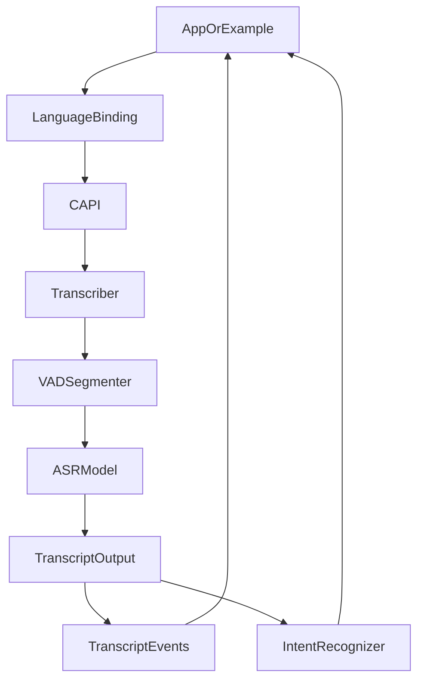
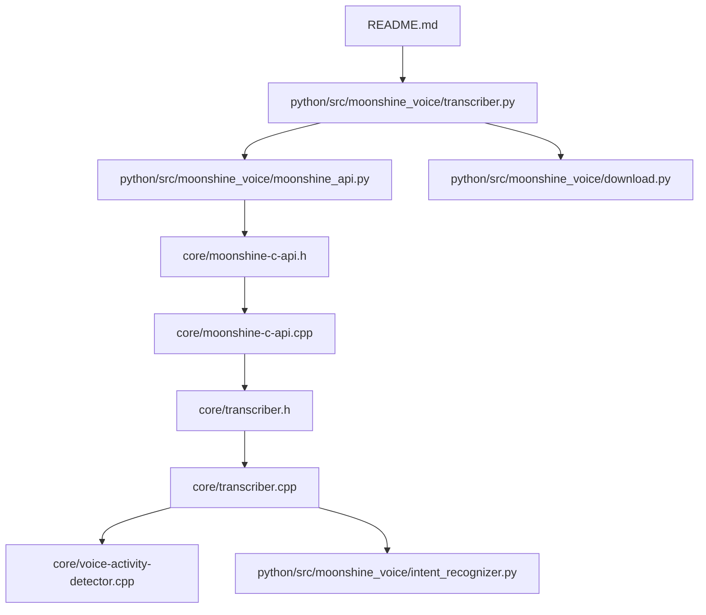
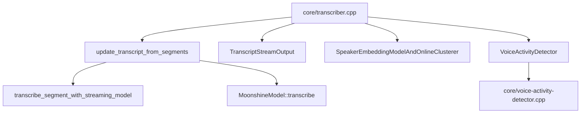
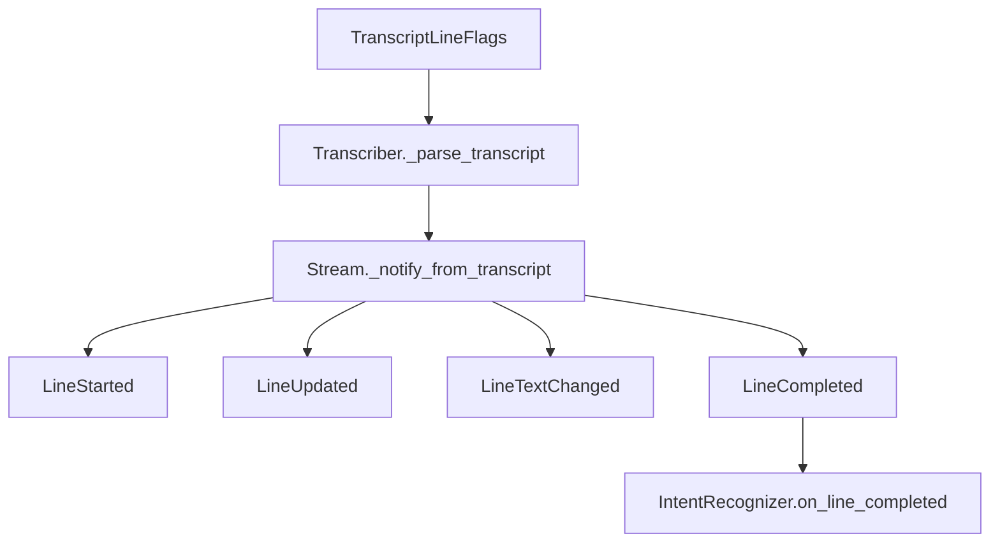
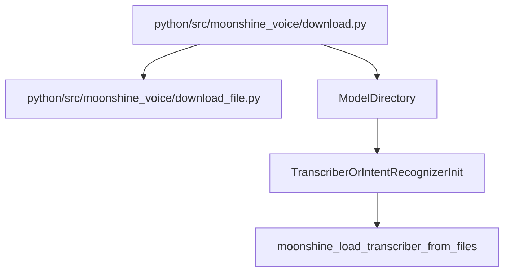
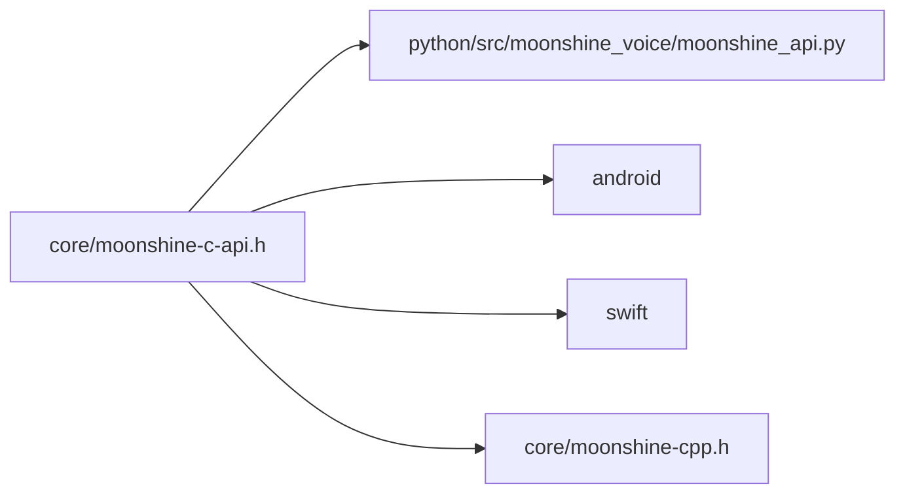
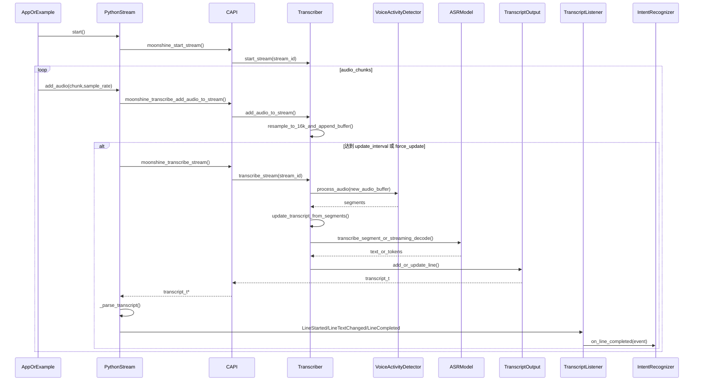
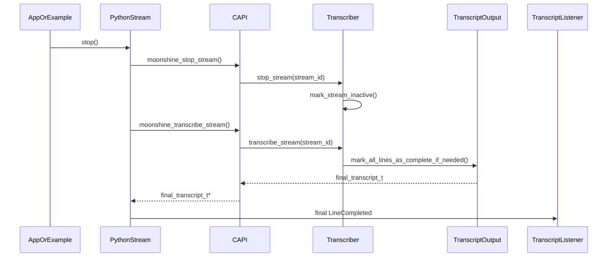
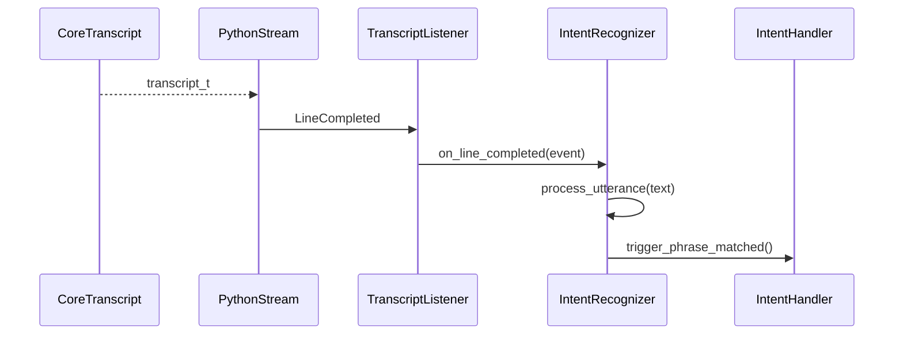

# Moonshine 原理及工作流程

## 1. 项目是什么

Moonshine 不是一个 Web 应用，也不是一个“云端语音 API 服务端”，而是一个**面向实时语音交互场景的端侧语音 SDK**。它的目标是让开发者在本地设备上完成整条语音处理链路，包括：

- 麦克风或音频流采集后的接入
- 语音活动检测（VAD）
- 语音转写（ASR）
- 可选的说话人识别/聚类
- 可选的意图识别
- 以事件形式把结果推送给上层应用

它强调的几个关键词是：

- **On-device**：模型在本地推理，不依赖云端识别接口
- **Streaming**：针对实时流式输入做了增量处理和状态缓存
- **Low latency**：重点优化“用户说完一句话后多久能给出结果”
- **Cross-platform**：同一套核心能力可被 Python、Swift、Android、Windows/C++ 等多平台复用

从仓库结构来看，Moonshine 的“单一事实来源”是 `core/` 里的 C++ 实现，其它语言层本质上都是对这套核心能力的封装。

## 2. 仓库结构与职责划分

项目的目录分工比较清晰：

- `core/`：C++ 核心引擎，包含 VAD、转写、流式状态管理、说话人识别、词级时间戳、C API 等
- `python/`：Python 包装层与下载器，也是最容易上手的使用入口
- `swift/`：Swift 包装层，服务于 iOS/macOS
- `android/`：JNI 和 Java 封装，服务于 Android
- `examples/`：各平台示例工程
- `scripts/`：构建、测试、发布脚本
- `test-assets/`：测试音频和模型资源

如果按“理解项目原理”的优先级排序，最关键的文件是：

1. `README.md`
2. `core/moonshine-c-api.h`
3. `core/transcriber.h`
4. `core/transcriber.cpp`
5. `core/voice-activity-detector.h`
6. `core/voice-activity-detector.cpp`
7. `python/src/moonshine_voice/moonshine_api.py`
8. `python/src/moonshine_voice/transcriber.py`
9. `python/src/moonshine_voice/intent_recognizer.py`
10. `python/src/moonshine_voice/download.py`

## 3. 整体架构

Moonshine 的总体架构可以概括成一句话：

**C++ 核心负责所有关键语音处理，C API 负责跨语言边界，语言绑定层负责把底层状态转换成上层更好用的对象与事件接口。**

这张图对应到仓库代码，大致映射如下：

- `AppOrExample`：`examples/` 下的示例程序，或者 Python 里的 `mic_transcriber.py`
- `LanguageBinding`：`python/src/moonshine_voice/*.py`、`swift/Sources/MoonshineVoice/*`、`android/`
- `CAPI`：`core/moonshine-c-api.h` 与 `core/moonshine-c-api.cpp`
- `Transcriber`：`core/transcriber.h` 与 `core/transcriber.cpp`
- `VADSegmenter`：`core/voice-activity-detector.*`
- `ASRModel`：`MoonshineModel` 或 `MoonshineStreamingModel`
- `IntentRecognizer`：C++ 侧意图识别器与 Python 的监听器封装

## 4. 设计原理

### 4.1 为什么 Moonshine 适合实时语音

README 里反复强调，Moonshine 的核心定位不是“离线批量转写”，而是“实时语音交互”。这个定位直接决定了它的实现方式：

- 它不假定输入必须是固定长度的大窗口音频
- 它允许持续不断地接收新的音频块
- 它会在用户仍在说话时就提前做一部分计算
- 它通过 VAD 把连续音频切成适合交互的语音段
- 它通过事件机制，把“开始说话”“文本更新”“一句话结束”等时机直接通知应用层

因此，Moonshine 更像一个“语音 UI 框架”，而不是一个单纯的“音频文件转文字函数”。

### 4.2 为什么采用 C++ 核心 + 多语言绑定

Moonshine 把所有复杂逻辑放在 `core/` 的 C++ 中，这样做有几个目的：

- 便于统一优化推理性能
- 便于跨平台部署 ONNX Runtime
- 避免在 Python、Swift、Java 中重复实现一套语音流水线
- 通过 C API 建立稳定的跨语言边界

因此，Python 层并不真正“做识别”，它更多负责：

- 加载动态库
- 把 C 结构体映射为 Python 对象
- 根据底层 transcript 的状态，派发更易理解的事件

## 5. 核心模块关系

### 5.1 `Transcriber`

`Transcriber` 是运行时主控对象。它负责：

- 加载模型
- 创建/管理多个 stream
- 驱动 VAD
- 根据分段结果调用转写模型
- 生成统一 transcript 输出
- 可选地执行说话人识别

它内部同时支持两类模型：

- `MoonshineModel`：非流式模型
- `MoonshineStreamingModel`：流式模型

这意味着对外暴露的 API 很统一，但内部会根据 `model_arch` 自动走不同实现分支。

### 5.2 `TranscriberStream`

`Transcriber` 可以挂多个 `TranscriberStream`。每个 stream 表示一个独立音频输入源，例如：

- 一个麦克风输入
- 一个系统音频输入
- 一个文件模拟的实时流

每个 stream 都有自己的：

- VAD 状态
- 新增音频缓冲区
- transcript 输出缓存

但多个 stream 可以共享同一套模型资源，这样避免重复加载模型。

### 5.3 `TranscriptStreamOutput`

这是底层 transcript 的缓存与输出适配器。它的职责是：

- 保存内部 line 映射
- 维护 line 的顺序
- 计算 `is_new`、`is_updated`、`has_text_changed` 等标记
- 把 C++ 内部结构整理成 C API 所需的 `transcript_t`

它本质上是“内部状态”和“跨语言可读结构”之间的桥。

### 5.4 `VoiceActivityDetector`

VAD 模块并不是单纯返回“是否有人声”，而是负责把连续音频组织成适合后续处理的语音段。它输出的 `VoiceActivitySegment` 包含：

- 当前段的音频数据
- 开始时间
- 结束时间
- 是否已经完成
- 本次更新是否发生变化

后续转写逻辑并不是直接对整条流做推理，而是对这些 segment 做推理。

## 6. 对外 API 设计

Moonshine 的跨语言 API 统一建立在 `core/moonshine-c-api.h` 上。它采用典型的 handle 设计：

- `transcriber_handle`
- `stream_handle`
- `intent_recognizer_handle`

这种方式的好处是：

- 语言边界简单
- 避免直接暴露复杂 C++ 类
- 便于在 Python/JNI/Swift 中稳定调用

主要调用可以分为三类：

### 6.1 创建与销毁

- `moonshine_load_transcriber_from_files()`
- `moonshine_load_transcriber_from_memory()`
- `moonshine_free_transcriber()`
- `moonshine_create_stream()`
- `moonshine_free_stream()`

### 6.2 非流式转写

- `moonshine_transcribe_without_streaming()`

### 6.3 流式转写

- `moonshine_start_stream()`
- `moonshine_transcribe_add_audio_to_stream()`
- `moonshine_transcribe_stream()`
- `moonshine_stop_stream()`

### 6.4 意图识别

- `moonshine_create_intent_recognizer()`
- `moonshine_register_intent()`
- `moonshine_process_utterance()`
- `moonshine_set_intent_threshold()`

## 7. 实时转写工作流程

这是 Moonshine 最重要的主线。

### 7.1 初始化阶段

上层应用通常会先做以下几步：

1. 准备模型目录
2. 创建 `Transcriber`
3. 创建默认 stream 或显式创建 stream
4. 注册事件监听器
5. 调用 `start()`

在 Python 中，这个过程被包装得更自然：

- `Transcriber(...)` 内部调用 `moonshine_load_transcriber_from_files()`
- `create_stream()` 内部调用 `moonshine_create_stream()`
- `start()` 内部调用 `moonshine_start_stream()`

### 7.2 音频输入阶段

应用不断地把音频块送进来：

- Python 侧调用 `add_audio(audio_data, sample_rate)`
- 底层转为 C 数组
- 调用 `moonshine_transcribe_add_audio_to_stream()`
- 最终进入 C++ 的 `Transcriber::add_audio_to_stream()`

此时不会立刻做完整转写，而是先完成两件事：

- 必要时把输入重采样到内部统一的 `16kHz`
- 把数据追加到 stream 的 `new_audio_buffer`

这一步设计得比较轻量，目的是允许在时间敏感的音频回调线程中安全调用。

### 7.3 触发转写阶段

当累计的新音频时长达到设定的 `transcription_interval`，或者显式强制更新时，才会进入真正的转写分析：

1. 读取 `new_audio_buffer`
2. 交给 VAD 进行切段
3. 拿到一组 `VoiceActivitySegment`
4. 对 `just_updated == true` 的 segment 逐个更新 transcript

这一步由 `Transcriber::transcribe_stream()` 驱动。

### 7.4 VAD 分段阶段

VAD 的输入是连续音频，但输出是“语音段”。

它的处理逻辑大致是：

1. 把输入重采样到 16kHz
2. 按 `hop_size` 分块
3. 对每块调用 Silero VAD 预测当前语音概率
4. 对概率做滑动窗口平均
5. 与阈值比较，判断当前是否处于有人声状态
6. 触发三种状态转换：
   - `on_voice_start()`
   - `on_voice_continuing()`
   - `on_voice_end()`

输出的 segment 会持续增长，直到：

- 检测到静音，句段结束
- 或者达到最大句段长度，被强制切段

### 7.5 句段转写阶段

对每个刚更新的 segment，`Transcriber::update_transcript_from_segments()` 会构造 `TranscriberLine`，并根据模型类型走不同路径：

- **流式模型**：走 `transcribe_segment_with_streaming_model()`
- **非流式模型**：走 `MoonshineModel::transcribe()`

这一步不仅生成文本，还会补充：

- 句段时间信息
- 词级时间戳（如果启用）
- 最近一次转写耗时
- 说话人 ID（如果启用）

### 7.6 结果缓存与状态标记

每个转写结果都会进入 `TranscriptStreamOutput`，由它判断：

- 这是不是一条新 line
- 文本是否发生变化
- 这条 line 是否已经完成

因此，Moonshine 的 transcript 不是“每次全量重建给上层自己 diff”，而是底层已经帮你维护好了最关键的增量状态。

### 7.7 事件派发阶段

Python 层拿到底层 transcript 后，会在 `Stream._notify_from_transcript()` 中把 line 状态转成事件：

- `LineStarted`
- `LineUpdated`
- `LineTextChanged`
- `LineCompleted`

这意味着应用层通常不必自己遍历整个 transcript，只需要监听事件并更新 UI 或业务状态即可。

### 7.8 结束阶段

调用 `stop()` 时：

- C API 会停止 stream
- 如果还有未完成的句段，Moonshine 会将其标记完成
- 最后再执行一次 transcript 更新
- 派发最终的 `LineCompleted`

这保证了“说到一半停止录音”时，上层仍能拿到最后的收尾结果。

## 8. 非流式转写工作流程

除了实时流式模式，Moonshine 也支持“拿一段完整音频一次性处理”。

入口是：

- `moonshine_transcribe_without_streaming()`
- Python 的 `Transcriber.transcribe_without_streaming()`

它的流程是：

1. 准备整段 PCM 音频
2. 创建或复用 batch stream
3. 启动 VAD
4. 用 VAD 把整段音频切成多个语音段
5. 对每个 segment 做转写
6. 生成最终 transcript

可以看出，**非流式并不是绕过 VAD**，而是仍然先切段，再对每段做识别。区别在于：

- 输入是一整段已知长度的音频
- 不需要维护实时 stream 的持续状态
- 更像“批处理一段录音”

不过从项目定位来看，这条路径更多是补充能力，Moonshine 的主要优化仍然面向实时交互。

## 9. VAD 的实现细节

Moonshine 的 VAD 设计有几个很实用的工程策略。

### 9.1 概率平滑

Silero VAD 每个 hop 都会给一个当前块的语音概率，但 Moonshine 不直接使用瞬时值，而是维护一个 `probability_window` 做平均。

好处是：

- 降低抖动
- 减少短暂噪声导致的误切
- 让语音段边界更稳定

### 9.2 Look-behind 回补

由于平滑会带来一点延迟，如果等到“平均值过阈值”才把音频算进句段，句首容易被截掉。

所以 Moonshine 维护了一个 `look_behind_audio_buffer`，在检测到语音开始时，把前面一小段音频也补回当前段里。

这样做的意义是：

- 减少吞字
- 让句首识别更完整

### 9.3 最大句段长度控制

真实语音里有时停顿很少，如果一直等自然静音再切段，结果可能形成很长的 segment，不利于交互和延迟。

因此 Moonshine 提供了 `vad_max_segment_duration`，并且在接近最大长度时逐步降低有效阈值，增加“自然结束”被触发的概率。

这是一种非常典型的“交互优先”策略：

- 宁愿更早得到可用结果
- 也不希望用户长时间说话时一直没有落地文本

## 10. 流式模型与非流式模型的差异

### 10.1 非流式模型

非流式模型的特点是：

- 对当前整段音频做完整推理
- 逻辑更直观
- 更适合文件型输入或不强调极低延迟的场景

模型文件通常包括：

- `encoder_model.ort`
- `decoder_model_merged.ort`
- `tokenizer.bin`

### 10.2 流式模型

流式模型是 Moonshine 的关键优势之一。它在 `transcribe_segment_with_streaming_model()` 中体现得最明显：

- 会区分“当前句段是不是新的 segment”
- 会维护 streaming state
- 只处理尚未处理过的新样本
- 把新音频按 80ms 小块推进模型
- 编码阶段复用先前状态
- 解码时根据当前 memory 重新生成文本

这套设计的核心价值是：

- **避免对整段音频反复从头编码**
- **把一部分计算前移到用户仍在说话的时候完成**
- **在句段结束时快速给出最终文本**

因此 Moonshine 的“低延迟”并不是只靠模型小，而是靠**流式状态缓存 + 增量计算**。

## 11. 词级时间戳与说话人识别

### 11.1 词级时间戳

如果启用了 `word_timestamps`，Moonshine 会尝试额外加载带 attention 的模型文件，或单独的 alignment 模型，从而计算词级时间戳。

这部分结果会被挂到 line 的 `words` 字段上，每个词包含：

- 文本
- 起始时间
- 结束时间
- 置信度

它适合做：

- 字幕高亮
- 逐词对齐显示
- 更细粒度的后处理

### 11.2 说话人识别

如果启用 `identify_speakers`，Moonshine 会在句段足够长或者句段结束时：

1. 用 `SpeakerEmbeddingModel` 提取说话人嵌入
2. 送入 `OnlineClusterer`
3. 产出 `speaker_id`
4. 再映射成便于显示的 `speaker_index`

因此对上层应用来说，你拿到的是：

- 一个可持久化或对比用的 `speaker_id`
- 一个更适合 UI 展示的 `speaker_index`

## 12. 事件系统为什么重要

Moonshine 的上层使用体验之所以比较友好，很大程度上来自它的事件模型。

它不是只返回一份文本，而是返回一套“语音交互状态变化”：

- 什么时候检测到新句段开始
- 什么时候文本变了
- 什么时候一句话最终结束

这种设计特别适合：

- 实时字幕
- 语音输入框
- 语音控制面板
- 智能助手 UI

应用层大多不需要轮询整个 transcript，只要订阅这些事件即可。

## 13. 意图识别工作流程

Moonshine 的意图识别不是单独拿音频直接做命令分类，而是建立在“先转写，再理解文本”的思路上。

工作流程如下：

1. 下载 embedding 模型
2. 创建 `IntentRecognizer`
3. 注册若干 trigger phrase 及对应回调
4. 把 `IntentRecognizer` 作为 `TranscriptEventListener` 加到 `Transcriber`
5. 当 `LineCompleted` 触发时，取已完成句段文本
6. 调用 `process_utterance()`
7. 用 embedding 模型计算语义相似度
8. 超过阈值时触发对应 intent 回调

这说明 Moonshine 的意图识别本质上是：

- **语音转文字**
- **文字转语义向量**
- **语义相似度匹配**

它不是传统严格关键词匹配，因此能识别“同义表达”。

例如注册命令是：

- `turn on the lights`

用户说：

- `switch on the lights`
- `lights on`
- `let there be light`

只要相似度足够高，都可能命中同一 intent。

## 14. Python 层在整个系统中的角色

Python 是最完整、最适合阅读的高层绑定。它主要做了三件事。

### 14.1 封装动态库加载

`moonshine_api.py` 会根据平台加载：

- `libmoonshine.so`
- `libmoonshine.dylib`
- `moonshine.dll`

并为 C API 设置 `ctypes` 函数签名。

### 14.2 对齐 C 结构体

Python 里的这些结构体直接映射 C API：

- `TranscriptWordC`
- `TranscriptLineC`
- `TranscriptC`
- `TranscriberOptionC`

因此可以把底层返回的内存结构转换为 Python 的 dataclass。

### 14.3 提供更友好的对象模型

Python 层额外提供：

- `Transcriber`
- `Stream`
- `TranscriptLine`
- `Transcript`
- `TranscriptEventListener`
- `IntentRecognizer`

对 Python 开发者来说，使用体验就像一个普通的事件驱动库，而不需要直接和 handle、指针、C 数组打交道。

## 15. 模型下载与缓存工作流程

Moonshine 的模型通常不是直接放在仓库里，而是首次使用时下载到本地缓存。

Python 下载流程大致如下：

1. 根据语言和 `model_arch` 查找模型信息
2. 判断该模型需要哪些组件文件
3. 逐个从 `https://download.moonshine.ai/...` 下载
4. 放到本地缓存目录
5. 返回模型目录路径和模型架构编号

不同模型的组件不同：

- 非流式模型通常是 `encoder_model.ort`、`decoder_model_merged.ort`、`tokenizer.bin`
- 流式模型通常还需要 `frontend.ort`、`encoder.ort`、`adapter.ort`、`decoder_kv.ort`、`streaming_config.json` 等

缓存目录默认由 `platformdirs.user_cache_dir("moonshine_voice")` 决定，也可以通过环境变量覆盖：

- `MOONSHINE_VOICE_CACHE`

这意味着工程侧最常见的启动方式是：

1. 先用 Python 下载模型
2. 拿到模型目录路径
3. 再让 Python、C++、Android、Swift 等语言层去加载这个目录

## 16. 工程构建与发布流程

Moonshine 的工程构建思路也很一致：**核心统一构建，平台分别分发**。

### 16.1 本地构建

核心库使用 CMake：

1. 进入 `core/`
2. 创建 `build/`
3. 运行 `cmake ..`
4. 运行 `cmake --build .`

完成后会得到测试程序和相关二进制。

### 16.2 Python 包装

Python 包的元信息在 `python/pyproject.toml` 中，包名为：

- `moonshine-voice`

它依赖：

- `numpy`
- `sounddevice`
- `requests`
- `tqdm`
- `filelock`
- `platformdirs`

这说明 Python 侧除了绑定动态库，还承担了：

- 音频采集辅助
- 模型下载
- 下载缓存锁
- 命令行工具入口

### 16.3 发布脚本

`scripts/build-all-platforms.sh` 体现了项目的发布路径：

- 先跑核心测试
- 构建 Swift
- 发布 Swift
- 发布 Android
- 构建和上传 pip 包
- 发布二进制产物
- 再到 Linux、树莓派、Windows 远端环境分别构建和上传

从这个脚本可以看出，Moonshine 本质上是“一个核心，多种发行形式”的产品工程。

## 17. 从应用视角看一次完整调用链

如果以 Python 麦克风实时转写为例，一次完整调用链可以总结为：

1. `python -m moonshine_voice.mic_transcriber`
2. Python 下载或定位模型目录
3. Python 创建 `Transcriber`
4. `ctypes` 加载本地 `moonshine` 动态库
5. C API 创建 `Transcriber` 和 `Stream`
6. 麦克风音频持续送入 `add_audio()`
7. C++ 内部重采样并缓存到 stream
8. VAD 切分出语音段
9. ASR 模型对最新段做转写
10. 可选做词时间戳和说话人识别
11. transcript 被转换成 C 结构
12. Python 解析为 dataclass
13. Python 派发 `LineStarted`、`LineTextChanged`、`LineCompleted`
14. UI 或控制台打印结果

如果再加上意图识别，则在第 13 步之后继续：

15. `IntentRecognizer` 监听 `LineCompleted`
16. 对完整句子做语义匹配
17. 命中已注册 intent 时触发业务回调

## 18. 这个项目最值得把握的几个关键点

如果要抓住 Moonshine 的“本质”，最重要的是以下几点：

### 18.1 它不是单一模型包装，而是一条完整语音流水线

Moonshine 不只是“把 ASR 模型导出来给你调用”，而是把实时语音交互需要的关键环节都串起来了：

- 输入接入
- 分段
- 转写
- 可选说话人识别
- 事件输出
- 可选意图匹配

### 18.2 它的核心竞争力在流式增量处理

`transcribe_segment_with_streaming_model()` 所体现的增量编码、状态缓存与仅处理新样本，是整套系统低延迟的关键。

### 18.3 它通过 transcript 状态机把底层复杂性隐藏了

上层应用看到的是：

- 一条 line 新出现
- 一条 line 的文本更新了
- 一条 line 最终完成了

而不是自己处理底层音频、句段、缓存和差分逻辑。

### 18.4 它的跨平台策略非常清晰

核心逻辑只在 C++ 中实现一次，再通过 C API 向各语言输出统一能力。这使得 Python、Swift、Android 的接口风格可以保持一致。

## 19. 建议的源码阅读顺序

如果你要继续深入源码，推荐按这个顺序读：

1. `README.md`
2. `python/src/moonshine_voice/transcriber.py`
3. `python/src/moonshine_voice/moonshine_api.py`
4. `core/moonshine-c-api.h`
5. `core/moonshine-c-api.cpp`
6. `core/transcriber.h`
7. `core/transcriber.cpp`
8. `core/voice-activity-detector.cpp`
9. `python/src/moonshine_voice/intent_recognizer.py`
10. `python/src/moonshine_voice/download.py`

这个顺序的好处是：

- 先理解上层怎么用
- 再理解跨语言接口
- 最后进入核心算法流程

## 20. 总结

Moonshine 的本质可以概括为：

**一个以 C++ 为核心、针对实时语音交互优化的端侧语音 SDK。**

它的工作流程核心是：

**音频输入 -> VAD 切段 -> ASR 转写 -> transcript 增量更新 -> 事件回调 -> 可选意图识别**

它的工程设计核心是：

**C++ 核心统一实现 + C API 稳定边界 + 多语言轻量绑定 + Python 负责模型下载和快速集成**

如果从“原理”和“工作流程”两个维度来看，Moonshine 最值得理解的不是某一个模型文件，而是它如何把**实时语音交互所需的所有关键环节组织成一套低延迟、跨平台、事件驱动的统一框架**。

## 21. 源码阅读导图

这一节不是再重复前面的原理说明，而是把“**应该先看什么、再看什么、看每个文件是为了解决什么问题**”整理成一份更适合实际读源码时使用的地图。

### 21.1 先建立一条总阅读主线

如果你只想抓住项目主干，建议沿着下面这条主线阅读：

这条主线的意义是：

- `README.md` 负责告诉你“项目为什么存在”
- `python/src/moonshine_voice/transcriber.py` 负责告诉你“上层到底怎么用”
- `python/src/moonshine_voice/moonshine_api.py` 负责告诉你“Python 是怎么跨过语言边界的”
- `core/moonshine-c-api.h` 负责告诉你“底层到底对外承诺了什么接口”
- `core/moonshine-c-api.cpp` 负责告诉你“接口如何转到核心对象”
- `core/transcriber.cpp` 负责告诉你“真正的运行时主流程发生在哪里”
- `core/voice-activity-detector.cpp` 负责告诉你“音频是怎么被切成句段的”
- `python/src/moonshine_voice/intent_recognizer.py` 负责告诉你“转写结果如何继续进入意图理解”
- `python/src/moonshine_voice/download.py` 负责告诉你“模型是怎么进入系统的”

### 21.2 如果你关心“从调用入口一路跟到核心”

这一条路线最适合边读边在 IDE 里跳转定义。

#### 路线 A：Python 实时转写调用链

1. `python/src/moonshine_voice/mic_transcriber.py`
2. `python/src/moonshine_voice/transcriber.py`
3. `python/src/moonshine_voice/moonshine_api.py`
4. `core/moonshine-c-api.h`
5. `core/moonshine-c-api.cpp`
6. `core/transcriber.h`
7. `core/transcriber.cpp`
8. `core/voice-activity-detector.cpp`

你在这条路线上重点追这些函数：

- Python 侧：`Transcriber.__init__()`、`Stream.add_audio()`、`Stream.update_transcription()`
- C API 侧：`moonshine_load_transcriber_from_files()`、`moonshine_transcribe_add_audio_to_stream()`、`moonshine_transcribe_stream()`
- C++ 核心侧：`Transcriber::add_audio_to_stream()`、`Transcriber::transcribe_stream()`、`Transcriber::update_transcript_from_segments()`

如果按“真正开始有业务含义”的节点来看，分界点是：

- `add_audio()` 之前：还是上层接入逻辑
- `Transcriber::transcribe_stream()` 开始：进入核心运行时流程
- `update_transcript_from_segments()`：开始把音频段变成可消费的文本状态

### 21.3 如果你关心“算法和状态机到底怎么运转”

这一条路线适合想深入底层细节的人：

建议按这个顺序看：

1. `core/transcriber.h`
2. `core/transcriber.cpp`
3. `core/voice-activity-detector.h`
4. `core/voice-activity-detector.cpp`

重点关注这些概念：

- `TranscriberOptions`：系统有哪些可调参数
- `TranscriberStream`：每条音频流的局部状态放在哪里
- `TranscriptStreamOutput`：为什么能做增量更新
- `VoiceActivitySegment`：为什么上层看到的是“句段”而不是原始流
- `current_streaming_segment_id`、`streaming_samples_processed`：流式模型如何避免重复处理旧音频

### 21.4 如果你关心“事件系统是怎么从底层状态长出来的”

这一部分最适合做 UI、交互和产品逻辑的人读。

阅读顺序建议：

1. `python/src/moonshine_voice/moonshine_api.py`
2. `python/src/moonshine_voice/transcriber.py`
3. `python/src/moonshine_voice/intent_recognizer.py`

这条链路回答的是几个关键问题：

- C 返回的 `is_new`、`is_updated`、`has_text_changed` 到底怎么变成 Python 事件
- 为什么 `LineCompleted` 可以作为意图识别的稳定触发点
- 为什么应用层通常不需要自己维护一整份 transcript diff

### 21.5 如果你关心“模型是怎么进入系统的”

这一条是工程侧阅读路径：

建议阅读：

1. `python/src/moonshine_voice/download.py`
2. `python/src/moonshine_voice/download_file.py`
3. `python/src/moonshine_voice/transcriber.py`
4. `core/moonshine-c-api.h`

这条链路可以帮助你看懂：

- 为什么 Python 是最方便的模型入口
- 不同 `model_arch` 对应哪些文件组件
- 下载完成后，底层真正需要的只是“模型目录路径 + 架构编号”

### 21.6 如果你关心“跨平台封装是怎么统一起来的”

这条路径建议以 C API 为中心向外发散：

阅读方法建议是：

1. 先读 `core/moonshine-c-api.h`
2. 再任选一种绑定语言对照看
3. 最后再回到 `core/transcriber.h`

这样你会更容易理解：

- 为什么仓库里很多结构体需要多端同步
- 为什么 `TranscriberLine` 的字段改动会影响 Python、Swift、Android、C++ 多处封装
- 为什么 C API 是这个项目真正的公共协议层

### 21.7 按阅读目标拆分的建议路线

如果你没有时间通读整个仓库，可以按目标来选路线。

#### 目标一：我只想会用

看这些就够了：

1. `README.md`
2. `python/src/moonshine_voice/mic_transcriber.py`
3. `python/src/moonshine_voice/transcriber.py`
4. `python/src/moonshine_voice/download.py`

#### 目标二：我想知道实时转写为什么低延迟

重点看这些：

1. `README.md` 中 streaming 相关说明
2. `core/transcriber.cpp`
3. `core/voice-activity-detector.cpp`
4. 流式模型相关加载和 `transcribe_segment_with_streaming_model()`

#### 目标三：我想改事件系统或接 UI

重点看这些：

1. `python/src/moonshine_voice/moonshine_api.py`
2. `python/src/moonshine_voice/transcriber.py`
3. `TranscriptStreamOutput` 相关实现

#### 目标四：我想移植到新语言

重点看这些：

1. `core/moonshine-c-api.h`
2. `core/moonshine-c-api.cpp`
3. `python/src/moonshine_voice/moonshine_api.py`
4. `swift/` 或 `android/` 中任一绑定实现

#### 目标五：我想理解命令识别

重点看这些：

1. `python/src/moonshine_voice/intent_recognizer.py`
2. `core/moonshine-c-api.h` 里的 intent API
3. `download.py` 里的 embedding model 下载逻辑

### 21.8 最后给一条最实用的阅读建议

这个仓库最容易读迷路的地方，不在模型本身，而在“状态是在哪一层变化的”。

你可以一直带着这三个问题去看源码：

1. 这一步处理的是“原始音频”、还是“语音段”、还是“文本行”？
2. 这一步发生在“语言绑定层”、还是“C API 层”、还是“C++ 核心层”？
3. 这一步是在“创建状态”、还是“更新状态”、还是“把状态变成事件”？

只要这三个问题不丢，你读 `Moonshine` 时通常就不会乱。

## 22. 关键类与函数索引表

这一节适合在你实际读源码时当作“速查页”使用。你不需要一次全记住，只要知道遇到某个问题时应该先跳到哪个类、哪个函数即可。

### 22.1 核心类索引

| 名称 | 所在位置 | 作用 | 什么时候优先看 |
| --- | --- | --- | --- |
| `Transcriber` | `core/transcriber.h` / `core/transcriber.cpp` | 核心总控对象，负责模型加载、stream 管理、转写主流程和 transcript 更新 | 想理解项目主流程时 |
| `TranscriberStream` | `core/transcriber.h` / `core/transcriber.cpp` | 单条输入流的运行时状态，保存 VAD、音频缓冲和输出缓存 | 想理解多 stream 和实时状态时 |
| `TranscriptStreamOutput` | `core/transcriber.h` / `core/transcriber.cpp` | 维护 line 顺序、更新标志和 C API 输出结构 | 想理解增量更新与事件来源时 |
| `VoiceActivityDetector` | `core/voice-activity-detector.h` / `core/voice-activity-detector.cpp` | 将连续音频切成语音段，并维护段开始/持续/结束状态 | 想理解切段逻辑时 |
| `VoiceActivitySegment` | `core/voice-activity-detector.h` | 表示一个语音段，包括音频、时间范围和更新状态 | 想理解“为什么上层拿到的是 line/segment”时 |
| `MoonshineModel` | `core/moonshine-model.h` 及相关实现 | 非流式转写模型入口 | 想看离线/整段转写路径时 |
| `MoonshineStreamingModel` | `core/moonshine-streaming-model.h` 及相关实现 | 流式转写模型入口，支持增量编码和状态缓存 | 想看低延迟主因时 |
| `SpeakerEmbeddingModel` | `core/speaker-embedding-model.h` 及相关实现 | 计算说话人向量嵌入 | 想理解说话人识别时 |
| `OnlineClusterer` | `core/online-clusterer.h` 及相关实现 | 对说话人嵌入做在线聚类，产出 `speaker_id` | 想理解 speaker_id 如何生成时 |
| `IntentRecognizer` | Python: `python/src/moonshine_voice/intent_recognizer.py`；C++ 侧通过 C API 驱动 | 监听完整句子并做意图匹配 | 想理解命令识别时 |
| `_MoonshineLib` | `python/src/moonshine_voice/moonshine_api.py` | Python 动态库加载器与 C 函数签名注册器 | 想理解 Python 如何调用 native 库时 |
| `Stream` | `python/src/moonshine_voice/transcriber.py` | Python 层的实时流封装，负责 add_audio、update、事件派发 | 想理解 Python 实时调用链时 |

### 22.2 关键函数索引

| 函数 | 所在位置 | 作用 | 备注 |
| --- | --- | --- | --- |
| `moonshine_load_transcriber_from_files()` | `core/moonshine-c-api.cpp` | 从模型目录创建 transcriber handle | Python/Swift/Android 最终都会落到这里 |
| `moonshine_create_stream()` | `core/moonshine-c-api.cpp` | 创建 stream handle | 实时模式入口之一 |
| `moonshine_transcribe_add_audio_to_stream()` | `core/moonshine-c-api.cpp` | 往 stream 塞入新音频 | 这一步偏轻量，不做完整分析 |
| `moonshine_transcribe_stream()` | `core/moonshine-c-api.cpp` | 触发一次 stream 分析并返回 transcript | 实时主流程关键入口 |
| `moonshine_transcribe_without_streaming()` | `core/moonshine-c-api.cpp` | 对整段音频做非流式转写 | 离线补充路径 |
| `Transcriber::add_audio_to_stream()` | `core/transcriber.cpp` | 把输入重采样后放入 `new_audio_buffer` | 连接输入层和核心处理层 |
| `Transcriber::transcribe_stream()` | `core/transcriber.cpp` | 判断是否达到分析条件，驱动 VAD 和 transcript 更新 | 实时核心入口 |
| `Transcriber::update_transcript_from_segments()` | `core/transcriber.cpp` | 把 VAD 输出的 segment 转成可消费的 transcript line | 整个项目最值得细读的函数之一 |
| `Transcriber::transcribe_segment_with_streaming_model()` | `core/transcriber.cpp` | 流式模型增量处理和解码 | 低延迟实现核心 |
| `VoiceActivityDetector::process_audio()` | `core/voice-activity-detector.cpp` | 对输入音频做分块处理和 VAD 更新 | 切段入口 |
| `VoiceActivityDetector::process_audio_chunk()` | `core/voice-activity-detector.cpp` | 对单个 hop 计算概率并更新状态机 | 真正的 VAD 状态转换核心 |
| `TranscriptStreamOutput::add_or_update_line()` | `core/transcriber.cpp` | 判断 line 是新增还是更新，并设置文本变化标记 | 理解事件来源的关键函数 |
| `TranscriptStreamOutput::update_transcript_from_lines()` | `core/transcriber.cpp` | 把内部结构整理成 `transcript_t` | 跨语言输出关键桥梁 |
| `Transcriber._parse_transcript()` | `python/src/moonshine_voice/transcriber.py` | 把 C transcript 转成 Python dataclass | Python 层解析关键入口 |
| `Stream._notify_from_transcript()` | `python/src/moonshine_voice/transcriber.py` | 根据 line flags 派发事件 | UI/监听器开发重点关注 |
| `IntentRecognizer.on_line_completed()` | `python/src/moonshine_voice/intent_recognizer.py` | 在句段完成时触发意图识别 | 意图识别最关键的挂接点 |
| `get_model_for_language()` | `python/src/moonshine_voice/download.py` | 按语言/架构定位并下载转写模型 | 模型下载入口 |
| `get_embedding_model()` | `python/src/moonshine_voice/download.py` | 下载 embedding 模型 | 意图识别模型入口 |

### 22.3 按问题反查源码

当你带着一个具体问题进仓库时，可以直接按下面的方式跳转。

| 你想回答的问题 | 建议先看 |
| --- | --- |
| “这个项目最核心的主流程在哪里？” | `core/transcriber.cpp` |
| “音频为什么会被分成一段一段？” | `core/voice-activity-detector.cpp` |
| “为什么 Python 能直接拿到事件？” | `python/src/moonshine_voice/transcriber.py` |
| “跨语言接口到底长什么样？” | `core/moonshine-c-api.h` |
| “C API 是怎么落到 C++ 对象上的？” | `core/moonshine-c-api.cpp` |
| “流式模型为什么低延迟？” | `Transcriber::transcribe_segment_with_streaming_model()` |
| “speaker_id 是怎么来的？” | `core/transcriber.cpp` 中说话人相关路径 |
| “命令识别什么时候被触发？” | `python/src/moonshine_voice/intent_recognizer.py` |
| “模型文件应该放什么、去哪下载？” | `python/src/moonshine_voice/download.py` |
| “我如果要移植新语言该从哪开始？” | `core/moonshine-c-api.h` + 任一现有绑定实现 |

### 22.4 推荐的 IDE 跳转顺序

如果你现在就在 IDE 里边点边看，最顺手的跳转顺序通常是：

1. 先打开 `python/src/moonshine_voice/transcriber.py`
2. 从 `Stream.add_audio()` 跳到 C API 名称
3. 打开 `core/moonshine-c-api.cpp`
4. 从 `moonshine_transcribe_stream()` 跳到 `Transcriber::transcribe_stream()`
5. 再从那里进入 `update_transcript_from_segments()`
6. 然后顺着 `VoiceActivityDetector`、`TranscriptStreamOutput`、`transcribe_segment_with_streaming_model()` 分别展开

这个顺序的优势是：

- 先看调用方，再看实现方
- 先看边界，再看内部状态
- 先抓主干，再进入细节

### 22.5 一句话记住每一层

如果你想用最短的话记住整个仓库的职责分层，可以这样记：

- `README.md`：解释项目为什么存在
- `python/`：解释开发者怎么用
- `moonshine-c-api.*`：解释跨语言如何接入
- `transcriber.*`：解释系统主流程怎么跑
- `voice-activity-detector.*`：解释音频怎么变成句段
- `download*.py`：解释模型怎么进入系统

把这六句话记住，后面再回头读源码时会轻松很多。

## 23. 实时转写时序图

前面的章节已经解释了模块职责和调用关系，这一节换一个角度，用“时间顺序”把一次实时转写会话串起来看。

### 23.1 主时序：从 `start()` 到事件派发

这个时序图对应的是最常见的使用方式：应用持续喂音频，Python 在合适时机触发一次底层分析，然后再把 line 状态翻译成事件。

### 23.2 按阶段拆开理解这张图

#### 阶段一：启动阶段

这一阶段做的事情很少，但它会把后续所有状态初始化好：

1. 应用层调用 `start()`
2. Python `Stream.start()` 调用 `moonshine_start_stream()`
3. C++ `Transcriber::start_stream()` 清空旧 session 的 transcript 状态
4. `VoiceActivityDetector` 进入 active 状态

这个阶段之后，系统才允许接收新的音频块。

#### 阶段二：进音频但暂不分析

应用不断调用 `add_audio()` 时，Moonshine 的策略不是每来一块就立刻全量转写，而是先做低成本处理：

1. Python 把音频转成 C 数组
2. 调用 `moonshine_transcribe_add_audio_to_stream()`
3. C++ 侧把数据重采样到内部 16kHz
4. 追加到 `new_audio_buffer`

这一阶段的重点是“积累可分析的新样本”，而不是立即输出结果。

#### 阶段三：达到分析条件

只有在满足条件时，Moonshine 才会触发较重的分析流程：

- 新增音频时长达到 `transcription_interval`
- 或者上层显式传入 `MOONSHINE_FLAG_FORCE_UPDATE`

这一步是 `Transcriber::transcribe_stream()` 的职责边界。

#### 阶段四：VAD 切段

一旦开始分析，第一件事不是直接跑 ASR，而是先走 VAD：

1. `VoiceActivityDetector::process_audio()`
2. 对音频做 hop 切块
3. 调用 Silero VAD 估计语音概率
4. 做平滑窗口平均
5. 更新段开始/持续/结束状态
6. 输出若干 `VoiceActivitySegment`

这里的关键点是：**ASR 并不直接消费整条流，而是消费 VAD 输出的 segment。**

#### 阶段五：segment 转 line

接下来 `Transcriber::update_transcript_from_segments()` 会对每个刚刚发生变化的 segment 做处理：

1. 填充 line 的时间范围和完成状态
2. 选择流式模型或非流式模型做转写
3. 记录转写耗时
4. 可选补充词时间戳
5. 可选补充 speaker_id
6. 更新 `TranscriptStreamOutput`

这一步是整个系统里“语音段变成文本状态”的核心。

#### 阶段六：底层 transcript 变成 Python 事件

当 C++ 已经产出 `transcript_t` 后：

1. Python `_parse_transcript()` 把 C 结构体解析成 dataclass
2. `Stream._notify_from_transcript()` 读取 line 的 flags
3. 根据不同状态发出：
   - `LineStarted`
   - `LineUpdated`
   - `LineTextChanged`
   - `LineCompleted`

所以从上层应用视角看，拿到的不是“一个黑盒字符串”，而是一串有阶段语义的事件。

### 23.3 停止时的收尾时序

实时系统最容易忽略的一点是：如果用户停止录音时最后一句话还没完全自然结束，该怎么办？

Moonshine 的处理方式是：`stop()` 不只是结束输入，还会尽量把最后活跃的 line 收尾完成。

这里的关键设计是：

- `stop()` 后仍会再做一次 transcript 更新
- 未完成的 line 会被补成 complete
- 上层监听器仍然能收到最终的 `LineCompleted`

这能显著减少“最后一句被吞掉”的体验问题。

### 23.4 意图识别插入在什么位置

很多人第一次看这个仓库时，会误以为意图识别和转写是两套并行管线。实际上它们在默认使用方式下是串联的：

也就是说：

- 先有完整句子
- 再有意图匹配
- 最后才触发业务动作

所以如果你要改命令识别，通常不是去改 VAD，而是去看：

- `LineCompleted` 什么时候被发出
- `IntentRecognizer.on_line_completed()` 怎么处理文本
- 相似度阈值和 embedding 模型如何配置

### 23.5 从时序图中最该看出的 5 件事

#### 1. `add_audio()` 和 `transcribe_stream()` 是分离的

这意味着系统能把“音频接入成本”和“推理成本”拆开，避免每个音频块都做重计算。

#### 2. VAD 在 ASR 之前

Moonshine 不是拿整条原始流反复转文字，而是先找出更合适的语音段，再做文本生成。

#### 3. transcript 是中间态，不只是最终结果

它既是跨语言传输结构，也是事件系统的数据来源。

#### 4. 事件是 Python 层从底层标志推导出来的

这说明如果你改了 line flags 的语义，就会连带影响上层事件表现。

#### 5. 意图识别默认依赖 `LineCompleted`

这说明它更偏向“整句理解”，而不是字词级实时指令触发。

### 23.6 配合时序图的推荐阅读点

如果你想把这一节和源码对应起来，建议边看图边打开这些位置：

1. `python/src/moonshine_voice/transcriber.py` 里的 `Stream.start()`、`Stream.add_audio()`、`Stream.update_transcription()`、`Stream._notify_from_transcript()`
2. `core/moonshine-c-api.cpp` 里的 `moonshine_start_stream()`、`moonshine_transcribe_add_audio_to_stream()`、`moonshine_transcribe_stream()`、`moonshine_stop_stream()`
3. `core/transcriber.cpp` 里的 `start_stream()`、`add_audio_to_stream()`、`transcribe_stream()`、`update_transcript_from_segments()`
4. `core/voice-activity-detector.cpp` 里的 `process_audio()` 与 `process_audio_chunk()`
5. `python/src/moonshine_voice/intent_recognizer.py` 里的 `on_line_completed()`

只要把这 5 组位置对上，你基本就能把 Moonshine 的实时转写主链完全读通。

## 24. 配置参数影响表

Moonshine 的很多运行行为不是写死的，而是由 `Transcriber` 的 `options` 决定。理解这些参数的影响，比死记源码细节更实用，因为它们直接决定了：

- 转写更新频率
- 切段是否灵敏
- 延迟和稳定性的平衡
- 内存与调试开销
- 是否启用附加能力

下面这张表主要基于 `README.md` 中的参数说明，以及 `core/moonshine-c-api.cpp` 对这些参数的实际解析逻辑整理而成。

### 24.1 核心参数总表

| 参数 | 主要作用 | 调大后的典型效果 | 调小后的典型效果 | 适用场景 |
| --- | --- | --- | --- | --- |
| `transcription_interval` | 控制多久触发一次转写分析 | 更新更稀疏，CPU 更省，但中间文本刷新更慢 | 更新更频繁，交互更灵敏，但分析更频繁 | 实时字幕、语音输入框 |
| `vad_threshold` | 控制 VAD 判定“这里有语音”的敏感度 | 更容易把音频切碎，可能截断真实语音 | 更容易把静音和噪声并入同一段，段更长 | 噪声环境、短句交互 |
| `vad_window_duration` | 控制 VAD 平滑窗口长度 | 判定更稳，但更容易错过短促语音、响应稍慢 | 更快发现说话开始，但更容易抖动 | 语音命令、快节奏交互 |
| `vad_look_behind_sample_count` | 补回检测前的音频，避免吞句首 | 句首更完整，但可能带入更多前置噪声 | 句首更干净，但更可能吞字 | 麦克风首字经常被截断时 |
| `vad_max_segment_duration` | 控制单段最长时长 | 允许更长句段，结果更完整，但回包更晚 | 更早切段，更利于交互，但可能把一句拆多段 | 长语音输入或实时对话 |
| `max_tokens_per_second` | 防止解码无限循环或重复输出 | 更宽松，减少误截断，但更难抑制异常重复 | 更严格，更容易截断可疑输出，但可能误伤有效文本 | 非拉丁语言或幻觉控制 |
| `identify_speakers` | 是否做说话人识别 | 开启后信息更丰富，但多一段计算开销 | 关闭后更轻量 | 会议纪要、多人场景 |
| `return_audio_data` | 是否把 line 对应音频一起返回 | 开启后方便后处理，但内存占用更高 | 关闭后更省内存 | 只关心文本的场景 |
| `word_timestamps` | 是否生成词级时间戳 | 信息更细，适合字幕对齐，但通常需要更多模型支持与额外计算 | 更轻量 | 字幕、逐词高亮 |
| `skip_transcription` | 是否跳过 ASR，只保留分段结果 | 可作为“只做 VAD/分段”的管线 | 无法直接得到文字 | 自定义后处理或替换 ASR |
| `log_api_calls` | 是否记录 C API 调用日志 | 更容易排查调用顺序和参数问题 | 控制台更干净 | 调试绑定层问题 |
| `log_ort_run` / `log_ort_runs` | 是否记录 ONNX Runtime 推理信息 | 便于看推理耗时和模型运行情况 | 日志更少 | 性能分析 |
| `log_output_text` | 是否直接打印模型输出 | 便于跟踪模型行为 | 更安静 | 识别质量调试 |
| `save_input_wav_path` | 是否把接收到的音频保存成 WAV | 容易排查音频输入是否失真 | 不额外占磁盘 | 怀疑采音链有问题时 |

### 24.2 哪些参数最影响“延迟 vs 稳定性”

如果只看实时体验，最关键的是下面 5 个参数：

#### `transcription_interval`

这是最直接影响“中间文字多久刷新一次”的参数。

- 更小：用户说话过程中更快看到文本变化
- 更大：中间更新更少，但整体开销更低

要注意的是，README 里已经说明，**对于 streaming model，它并不会线性决定最终完成延迟**，因为很多工作已经在说话过程中提前做掉了。

#### `vad_threshold`

这是最直接影响切段风格的参数。

- 偏高：更容易断句，但容易把连续语音切碎
- 偏低：更不容易断句，但可能把静音和背景噪声也吞进去

如果你的体验问题是“总是切得太碎”，优先看它。  
如果你的体验问题是“总是攒很久才出结果”，它也值得看。

#### `vad_window_duration`

它影响的是 VAD 平滑程度。

- 窗口更长：更稳，更不容易因瞬时噪声跳变
- 窗口更短：更快，但更敏感

它更像“稳定性滤波器”，不是直接的切段阈值。

#### `vad_look_behind_sample_count`

它不决定“要不要切段”，但会影响“句首会不会被吃掉”。

如果你发现：

- 每句话第一个词总是残缺
- 说话刚开始时识别容易漏字

优先怀疑这个参数和输入端音频缓冲配合问题。

#### `vad_max_segment_duration`

它是交互式体验里非常关键但容易忽略的参数。

如果用户说话很长，中间几乎不停顿，系统也不能永远等一个完美静音点。这个参数就是在控制：

- 最长允许一条 line 持续多久
- 超过这个时长后，系统多积极地尝试把它切开

### 24.3 哪些参数最影响“识别质量和输出完整度”

#### `max_tokens_per_second`

这个参数主要是一个保护阈值，用来防止模型陷入重复输出。

README 里特别提到：

- 英文默认大约 `6.5`
- 非拉丁语种可能需要提高到 `13.0`

所以如果你遇到：

- 输出经常被过早截断
- 某些语种正常文本被误判成异常重复

优先看这个参数。

#### `word_timestamps`

开启它后，系统会尝试加载支持 attention 或 alignment 的模型文件，得到逐词时间戳。

这通常意味着：

- 信息更完整
- 代码路径更复杂
- 推理和内存都有额外成本

如果你的目标只是实时字幕的大意展示，未必必须打开。  
如果你的目标是字幕精确对齐，它就很重要。

#### `identify_speakers`

开启后会多做一段 speaker embedding 和在线聚类。

它的收益是：

- line 能带 `speaker_id`
- UI 可以显示 `speaker_index`

它的代价是：

- 增加额外计算
- 准确率受说话时长和音质影响

所以单人设备语音交互通常可以关掉，多人会议或采访场景则更值得打开。

### 24.4 哪些参数最适合用来调试问题

#### `save_input_wav_path`

这是排查音频链最有价值的参数之一。

当你怀疑问题出在：

- 麦克风采样率转换
- 声道处理
- 音频失真
- 上层传入的数据不对

先把输入保存下来听一遍，往往比盯日志更快。

#### `log_api_calls`

适合排查这些问题：

- 调用顺序是否正确
- `start()` / `stop()` / `add_audio()` 有没有乱序
- 某些 handle 是否被重复或错误使用

这是跨语言绑定问题的第一优先调试手段。

#### `log_ort_run`

适合排查：

- 模型是否真的被调用
- 哪一步推理最慢
- 是否某个模型组件耗时异常

如果你关心性能而不只是功能，这是最值得开的日志之一。

#### `log_output_text`

适合排查：

- 模型中间输出是否稳定
- 某次文本变化是不是模型本身导致
- 上层事件逻辑是否只是忠实地转发了底层结果

### 24.5 三组常见调参策略

#### 场景一：做实时字幕，希望更“跟手”

优先考虑：

- 适度减小 `transcription_interval`
- 适度减小 `vad_window_duration`
- 保持 `vad_threshold` 在中间值附近，避免过碎切段

目标是：

- 中间文本更快刷新
- 用户能明显感觉系统在“跟着他说”

#### 场景二：做语音命令，希望整句更稳定

优先考虑：

- 适度增大 `vad_window_duration`
- 适度调高 `vad_threshold`
- 保证 `LineCompleted` 触发后再做意图判断

目标是：

- 少误触发
- 少在半句话时就开始理解

#### 场景三：做多人会议记录，希望信息更完整

优先考虑：

- 打开 `identify_speakers`
- 需要时打开 `word_timestamps`
- 适度增大 `vad_max_segment_duration`
- 保留 `return_audio_data`

目标是：

- 每条 line 带更多结构化信息
- 方便后续整理与对齐

### 24.6 一个实用的调参顺序

如果你要现场调试，不建议一次改很多参数。更高效的方法是按下面的顺序逐层调：

1. 先确认输入音频没问题：`save_input_wav_path`
2. 再确认调用顺序没问题：`log_api_calls`
3. 再调切段行为：`vad_threshold`、`vad_window_duration`、`vad_max_segment_duration`
4. 再调刷新体验：`transcription_interval`
5. 最后再打开附加能力：`identify_speakers`、`word_timestamps`

这个顺序的核心思想是：

- 先排输入链问题
- 再排状态机问题
- 最后再碰附加能力和性能开销

### 24.7 最值得记住的经验

如果只记一句话，可以记这个：

**`transcription_interval` 主要影响“多久更新一次”，`vad_*` 系列主要影响“怎么切段”，`identify_speakers` / `word_timestamps` 主要影响“返回结果有多丰富”。**

把这三类作用分开理解，调参时就不容易混乱。

## 25. 常见问题排障手册

这一节把最常见的使用问题整理成“**现象 -> 可能原因 -> 优先排查 -> 建议处理**”的形式。  
如果你后面真的把 Moonshine 集成进应用里，这一节会比单纯看原理更常用。

### 25.1 最后一句话经常出不来，或者停止录音后没有最终结果

#### 现象

- 用户已经说完，但最后一句迟迟没有 `LineCompleted`
- 调用 `stop()` 之后仍感觉最后一句不完整
- UI 里一直停留在中间态文本，没有最终完成态

#### 可能原因

- 上层没有正确调用 `stop()`
- `stop()` 调用后没有让最后一次 transcript 更新跑完
- VAD 还没有判定到句段结束
- `transcription_interval` 太大，导致最后一段分析被拖后

#### 优先排查

1. 确认上层是否真的调用了 `Stream.stop()` / `Transcriber.stop()`
2. 检查是否收到了最终一次 `moonshine_stop_stream()` 和后续更新
3. 打开 `log_api_calls`
4. 观察是否最终触发了 `LineCompleted`

#### 建议处理

- 优先保证正常调用 `stop()`
- 如需更及时收尾，可适度减小 `transcription_interval`
- 如果是长句场景，可检查 `vad_max_segment_duration`

#### 关键源码位置

- `python/src/moonshine_voice/transcriber.py` 的 `Stream.stop()`
- `core/moonshine-c-api.cpp` 的 `moonshine_stop_stream()`
- `core/transcriber.cpp` 的 `stop_stream()`、`mark_all_lines_as_complete()`

### 25.2 每句话开头容易丢字，首字或前半个词经常缺失

#### 现象

- 句首经常少一个音节
- “你好”经常变成“好”
- 说话刚开始时识别最容易漏

#### 可能原因

- VAD 检测存在天然滞后
- `vad_look_behind_sample_count` 偏小
- 上游音频输入本身就有缓冲或裁剪
- 麦克风启动时前几十毫秒音频质量差

#### 优先排查

1. 打开 `save_input_wav_path`
2. 听保存下来的 WAV，确认问题是否已经存在于输入音频里
3. 如果原始输入没问题，再看 VAD 参数

#### 建议处理

- 适度增大 `vad_look_behind_sample_count`
- 检查采音链是否在启动时丢首帧
- 适度减小 `vad_window_duration`，降低平均带来的滞后

#### 关键源码位置

- `core/voice-activity-detector.cpp` 的 `look_behind_audio_buffer`
- `VoiceActivityDetector::on_voice_start()`
- `core/transcriber.cpp` 的重采样与 buffer 逻辑

### 25.3 切段太碎，一句话被拆成很多行

#### 现象

- 用户明明在连续说话，却被分成多个 `LineCompleted`
- 句子中途短暂停顿就被切断
- UI 一直新起很多短 line

#### 可能原因

- `vad_threshold` 偏高
- `vad_window_duration` 偏短
- 输入环境噪声大，导致 VAD 抖动
- 用户说话本身很短促

#### 优先排查

1. 看 `LineStarted` / `LineCompleted` 是否过于频繁
2. 检查保存下来的输入音频是否有明显噪声或断续
3. 先调 VAD，再怀疑模型

#### 建议处理

- 适度降低 `vad_threshold`
- 适度增大 `vad_window_duration`
- 必要时检查上游是否有音频断流

#### 关键源码位置

- `core/voice-activity-detector.cpp` 的概率平滑和阈值判定
- `VoiceActivityDetector::process_audio_chunk()`

### 25.4 出字太慢，中间文本更新不及时

#### 现象

- 用户已经说了很久，界面还没有中间文本
- 只有说完整句后才明显更新
- 实时体验不够“跟手”

#### 可能原因

- `transcription_interval` 偏大
- 上层没有及时调用 `update_transcription()`
- 使用方式更接近离线处理，而不是实时流模式
- 设备性能不足，推理本身较慢

#### 优先排查

1. 看是不是使用了 `Stream.add_audio()` + 实时 update 链路
2. 检查 `transcription_interval`
3. 打开 `log_ort_run`
4. 观察到底是“没触发分析”还是“分析太慢”

#### 建议处理

- 适度减小 `transcription_interval`
- 优先使用 streaming model
- 如果只是想更快看到中间态，不一定要等完整句子结束

#### 关键源码位置

- `python/src/moonshine_voice/transcriber.py` 的 `Stream.add_audio()`
- `core/transcriber.cpp` 的 `transcribe_stream()`
- `core/transcriber.cpp` 的 `transcribe_segment_with_streaming_model()`

### 25.5 文本会重复、循环，或者被异常截断

#### 现象

- 最后几个词反复重复
- 输出突然被截短
- 某些语言更容易出现重复或截断异常

#### 可能原因

- 解码进入重复循环
- `max_tokens_per_second` 设置不合适
- 非拉丁语言 token 密度更高，沿用英文阈值导致误判

#### 优先排查

1. 确认问题是否集中出现在特定语种
2. 检查当前 `max_tokens_per_second` 设置
3. 打开 `log_output_text` 观察异常出现的阶段

#### 建议处理

- 非拉丁语种优先尝试把 `max_tokens_per_second` 提高到 README 建议范围
- 如果是明显重复而非误截断，则适当保持保护阈值

#### 关键源码位置

- `README.md` 里的 `max_tokens_per_second` 说明
- `core/transcriber.cpp` 中流式解码和 token 限制逻辑

### 25.6 说话人识别不稳定，speaker_id 经常变化

#### 现象

- 同一个人被识别成多个 speaker
- 刚开始没有 speaker_id，后面才出现
- speaker 切换不符合直觉

#### 可能原因

- 句段太短，不足以稳定提取 speaker embedding
- 环境噪声或录音质量差
- 说话人识别本身仍属实验性能力
- 聚类阈值与场景不匹配

#### 优先排查

1. 确认 `identify_speakers` 已开启
2. 看 line 是否在 complete 后才拿到 speaker_id
3. 检查音频质量和说话时长

#### 建议处理

- 不要期待特别短的语音段有稳定 speaker_id
- 多人长句场景下效果通常更好
- 单人交互场景通常直接关闭更合适

#### 关键源码位置

- `core/transcriber.cpp` 中 `SpeakerEmbeddingModel` 和 `OnlineClusterer` 路径
- `README.md` 中对 `identify_speakers` 的说明

### 25.7 意图识别不触发，但转写文本看起来正常

#### 现象

- 文本已经识别出来了，但注册的命令没有触发
- 控制台能看到句子，却没有 intent callback
- 同义句触发率不稳定

#### 可能原因

- `IntentRecognizer` 没有被加到 transcriber listener 上
- 没有收到 `LineCompleted`
- 相似度阈值过高
- 触发短语设计得过于具体
- embedding 模型没有正确下载或加载

#### 优先排查

1. 确认 `transcriber.add_listener(intent_recognizer)` 已执行
2. 确认 `IntentRecognizer.on_line_completed()` 的调用链确实发生
3. 检查当前 `threshold`
4. 尝试更泛化、更自然的 trigger phrase

#### 建议处理

- 先保证完整句完成后再做命令判断
- 先降低一点阈值测试命中率
- 不要把 trigger phrase 设计得过于僵硬

#### 关键源码位置

- `python/src/moonshine_voice/intent_recognizer.py`
- `python/src/moonshine_voice/transcriber.py` 的 listener 派发逻辑
- `core/moonshine-c-api.h` 的 intent API

### 25.8 模型似乎没加载成功，或者调用时直接报错

#### 现象

- 创建 `Transcriber` 时直接抛异常
- 动态库能加载，但模型目录无效
- 某些模型文件缺失时报 Unknown error

#### 可能原因

- 模型目录不存在
- 缺少必需组件文件
- `model_arch` 与目录内容不匹配
- 动态库存在，但模型文件版本或结构不对

#### 优先排查

1. 先看错误日志
2. 确认模型目录里是否真的包含该架构所需文件
3. 确认下载路径和 `model_arch` 一致

#### 建议处理

- 优先通过 Python 下载器拿模型路径，减少手工拼目录错误
- 流式与非流式模型不要混用组件

#### 关键源码位置

- `python/src/moonshine_voice/download.py`
- `core/transcriber.cpp` 的 `load_from_files()`
- `core/moonshine-c-api.cpp` 的 transcriber 创建逻辑

### 25.9 一个通用排障顺序

如果你遇到问题，但暂时还不知道归类到哪一项，建议按下面顺序排：

1. 先看日志是否已有明确错误
2. 再保存输入音频，确认问题是不是发生在采音链
3. 再看调用顺序是否正确：`start -> add_audio -> update/stop`
4. 再调 VAD 参数，看问题是否属于切段不合理
5. 再看 ASR 输出和 token 行为
6. 最后再看 speaker / intent 这类附加能力

这个顺序很有效，因为它遵循了从“输入”到“核心主链”再到“附加能力”的层级。

### 25.10 最实用的排障原则

如果只记一句经验，可以记成：

**先确认输入对不对，再确认时序对不对，最后才去怀疑模型本身。**

大多数集成问题其实都出在：

- 音频输入不对
- `start/stop/add_audio` 顺序不对
- VAD 参数不适合当前场景

而不是模型“完全不能用”。
